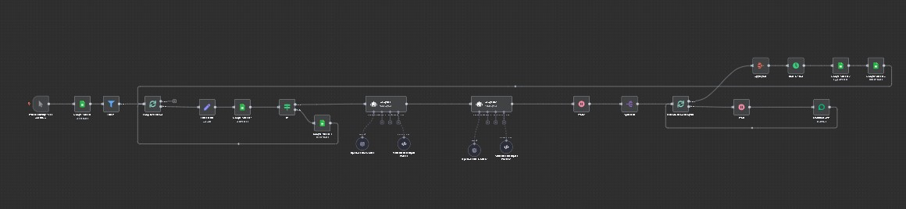

# 🤖 Sistema de Prospecção Inteligente com IA

> **Categoria:** Comercial | **Complexidade:** ⭐⭐ | **Status:** ✅ Em Produção

## 📝 Visão Geral

Criei este workflow para resolver um problema crítico na prospecção: **enviar mensagens genéricas que ninguém responde**. A solução usa IA (GPT-4o-mini) em duas etapas: primeiro analisa o site e Instagram do prospect para entender o negócio, depois cria mensagens ultra-personalizadas que se adaptam ao tom de comunicação de cada empresa.

O diferencial é que a IA atua como um representante comercial e cria abordagens únicas para cada lead, respeitando a identidade da marca do prospect.

## 🎯 Por Que Criei Esta Automação

**O problema:**
- Mensagens genéricas têm taxa de resposta baixíssima
- Analisar manualmente cada site/Instagram para personalizar é inviável
- Criar mensagens personalizadas manualmente consome horas
- Difícil escalar prospecção mantendo qualidade

**A solução:**
Um sistema que analisa automaticamente o digital presence de cada lead, identifica o tom de comunicação deles, e cria mensagens de abordagem que parecem feitas por humano, totalmente personalizadas.

## 🏗️ Como Funciona

### Fluxo do Processo

```
1. Busca leads no Google Sheets (aba "Análise")
   ↓
2. Filtra apenas leads com telefone
   ↓
3. Para cada lead:
   ├─ Verifica se já foi processado (duplicata)
   ├─ Se novo, continua
   └─ Se já processado, deleta e pula
   ↓
4. IA Agent 1: Analisa Site + Instagram
   └─ Gera: Descrição, Proposta de Valor, Tom de Comunicação
   ↓
5. IA Agent 2: Cria mensagens personalizadas
   └─ Baseado na análise anterior
   └─ Máximo 400 caracteres (2 mensagens)
   ↓
6. Aguarda 10-15 min (delay aleatório)
   ↓
7. Envia mensagens via WhatsApp:
   ├─ Mensagem 1 (MensagemUnica)
   ├─ Aguarda 1-3 seg
   └─ Mensagem 2 (SistemaLift)
   ↓
8. Salva no Google Sheets (aba "Contatos Processados")
   ↓
9. Remove da fila (aba "Análise")
   ↓
10. Próximo lead
```

### Diagrama Visual



*Nota: Por questões de confidencialidade, o arquivo JSON não está disponível publicamente.*

## ⚙️ Componentes e Integrações

### Tecnologias Utilizadas:
- **N8N:** Plataforma de automação
- **OpenAI GPT-4o-mini:** Dois agentes de IA especializados
- **Evolution API:** Para envio via WhatsApp
- **Google Sheets:** Gerenciamento de leads

### Nodes do Workflow:
- **Manual Trigger:** Inicio manual
- **Google Sheets (4x):** Leitura, verificação, salvamento e deleção
- **Filter:** Remove leads sem telefone
- **Split In Batches (2x):** Loop de leads e quebra de mensagens
- **Edit Fields:** Formatação de dados
- **IF:** Verifica duplicatas
- **AI Agent (2x):** Análise e criação de mensagens
- **OpenAI Chat Model (2x):** Modelos de linguagem
- **Structured Output Parser (2x):** Formatação JSON
- **Wait (2x):** Delays entre ações
- **Date & Time:** Timestamp do processamento
- **Evolution API:** Envio WhatsApp
- **Split Out:** Separa mensagens
- **Aggregate:** Une resultados

## 🔧 Funcionalidades Principais

### 1. Sistema Anti-Duplicata Inteligente

Antes de processar qualquer lead, o workflow verifica se ele já foi contactado:

**Como funciona:**
- Busca na aba "Contatos Processados"
- Compara por Telefone + Nome
- Se encontrar: deleta da fila e pula
- Se não encontrar: processa normalmente

**Por que é importante?**
Evita enviar mensagem duplicada para o mesmo lead, o que passaria uma imagem não profissional.

### 2. IA Agente 1 - Análise de Digital Presence

O primeiro agente de IA recebe:
- Nome da loja/empresa
- Website
- Instagram

E retorna análise estruturada em JSON:

```json
{
  "descricao": "Resumo dos produtos/serviços oferecidos",
  "propostaValor": "Principais diferenciais da empresa",
  "tomComunicacao": "Tom identificado (sofisticado, moderno, etc)"
}
```

**Instruções do Agente:**
- Analisar site e/ou Instagram (o que estiver disponível)
- Identificar produtos e serviços oferecidos
- Extrair diferenciais competitivos
- Detectar o tom de comunicação da marca
- Se não houver informações suficientes, informar explicitamente

### 3. IA Agente 2 - Criação de Mensagens Personalizadas

O segundo agente atua como representante comercial e cria mensagens de prospecção.

**Persona do Agente:**
- Especialista em vendas/prospecção
- Tom profissional, consultivo e adaptável
- Focado em resolver problemas do prospect
- Direto e respeitoso com o tempo do prospect

**Prompting Avançado:**
O agente recebe um prompt detalhado que define:
- Como se apresentar
- Como adaptar ao tom da empresa prospectada
- Estrutura da mensagem
- Limite de caracteres (400 total)
- Uso sutil de emojis
- Criação de mensagens únicas (nunca repetir)

**Formato de Saída:**
```json
{
  "MensagemUnica": "Abordagem inicial personalizada",
  "SistemaLift": "Apresentação da solução/serviço"
}
```

As duas mensagens juntas não ultrapassam 400 caracteres.

### 4. Envio Inteligente com Delays Humanizados

**Delays entre etapas:**

1. **Após análise da IA:** 10-15 minutos aleatórios
   - Simula tempo de "pesquisa humana"
   - Evita parecer bot

2. **Entre mensagens:** 1-3 segundos aleatórios
   - Simula digitação humana
   - Mais natural no WhatsApp

**Por que delays aleatórios?**
```javascript
// Delay de 10-15 minutos
{{ Math.floor(Math.random() * (15 - 5 + 1) + 10) }} minutos

// Delay de 1-3 segundos  
{{ Math.floor(Math.random() * (3 - 1 + 1) + 1) }} segundos
```

Comportamento mais humano, reduz chance de bloqueio.

### 5. Processamento em Lote com Loop

O workflow processa um lead por vez:

**Loop Externo:** Itera pelos leads da planilha
**Loop Interno:** Quebra as 2 mensagens para envio sequencial

```
Lead 1 → Analisa → Cria mensagens → Envia → Salva → Deleta
  ↓ (volta pro início)
Lead 2 → Analisa → Cria mensagens → Envia → Salva → Deleta
  ↓
...
```

## 📊 Estrutura do Google Sheets

### Aba "Análise" (Input):
Leads que precisam ser processados

| Coluna | Descrição |
|--------|-----------|
| Nome | Nome da empresa |
| Telefone | WhatsApp no formato internacional |
| Site | URL do website |
| Instagram | Perfil do Instagram |

### Aba "Contatos Processados" (Output):
Histórico de leads já contactados

| Coluna | Descrição |
|--------|-----------|
| Nome | Nome da empresa |
| Telefone | WhatsApp contactado |
| Site | Website analisado |
| Instagram | Instagram analisado |
| Data | Data do processamento |

## 🎯 Exemplo Real de Funcionamento

**Input (da planilha):**
```
Nome: Empresa XYZ
Telefone: 5511999998888
Site: https://empresaxyz.com.br
Instagram: @empresaxyz
```

**IA Agent 1 analisa e retorna:**
```json
{
  "descricao": "Empresa especializada em [produto/serviço], com foco em [segmento específico]",
  "propostaValor": "Atendimento personalizado, qualidade premium e expertise no segmento",
  "tomComunicacao": "Profissional e consultivo"
}
```

**IA Agent 2 cria mensagens adaptadas ao tom:**
```json
{
  "MensagemUnica": "Olá! Sou [nome], da [empresa]. Admiro o trabalho da [empresa prospect]. Como vocês lidam com [desafio específico]?",
  "SistemaLift": "Desenvolvemos uma solução que otimiza [processo]. Posso explicar em 1 minuto?"
}
```

**Resultado:**
Mensagens enviadas com tom adequado, personalizadas, e que demonstram conhecimento real sobre o negócio.

## 🛡️ Tratamento de Erros

### Evolution API:
- Configurada com `onError: continueRegularOutput`
- Se falhar o envio, continua para o próximo
- Não trava o workflow inteiro

### Verificação de Campos:
- **Filter:** Remove leads sem telefone antes de processar
- **IF:** Verifica se lead já foi processado
- Sistema robusto contra dados incompletos

### Validação de Output da IA:
- Structured Output Parser garante formato JSON
- Se a IA não retornar no formato esperado, o parser força a estrutura

## 🎓 Conceitos Técnicos Aplicados

### Prompt Engineering Avançado:
- System prompts detalhados e estruturados
- Definição clara de persona
- Instruções de tom e estilo
- Limites e restrições explícitas
- Few-shot learning (exemplos)

### Chain of AI Agents:
- Agent 1 → Análise
- Output Agent 1 → Input Agent 2
- Agent 2 → Criação
- Processamento sequencial com contexto

### Humanização de Automação:
- Delays aleatórios
- Mensagens únicas (não templates)
- Tom adaptável
- Quebra de mensagens com pausa

### ETL com Controle de Estado:
- Extract: Lê da planilha
- Transform: IA processa
- Load: Salva resultado
- Delete: Remove processados (evita reprocessamento)

## 💻 Detalhes Técnicos Importantes

### Configuração dos AI Agents:

**Agent 1 (Análise):**
- Modelo: gpt-4o-mini
- Temperature: ~0.3 (mais factual)
- Output: Structured JSON

**Agent 2 (Criação):**
- Modelo: gpt-4o-mini  
- Temperature: 0.7-1.0 (mais criativo)
- Output: Structured JSON
- Instrução: "Jamais repita mensagens anteriores"

### Sistema de Agregação:

Após enviar as mensagens, o node **Aggregate** junta todos os outputs antes de salvar no Sheets. Isso garante que todas as informações sejam salvas de uma vez.

### Formatação de Data:

```javascript
Data atual formatada: dd-MMM-yyyy
Exemplo: 13-Oct-2025
```

Registra quando cada lead foi processado.

## 🚀 Como Usar

1. **Prepare a planilha "Análise"** com os leads
2. **Ajuste a persona do agente** conforme sua necessidade
3. **Execute o workflow** manualmente
4. **Monitore** o processamento (um lead por vez)
5. **Confira os resultados** na aba "Contatos Processados"
6. **Acompanhe respostas** no WhatsApp

**Tempo estimado por lead:** ~12-17 minutos
- Processamento IA: ~30 segundos
- Delay humanizado: 10-15 minutos
- Envio: ~5 segundos

## ⚠️ Limitações e Considerações

### Limitações Conhecidas:
- Dependente da qualidade das informações no site/Instagram
- IA pode não captar nuances muito específicas
- Consome créditos OpenAI por lead
- Processo relativamente lento (intencional, para parecer humano)
- Requer monitoramento das respostas

### Boas Práticas:
- Monitore as primeiras execuções
- Ajuste os prompts conforme feedback
- Mantenha a planilha organizada
- Responda rapidamente aos interessados
- Não processe muitos leads de uma vez (risco de bloqueio WhatsApp)

### Recomendações:
- Processe em lotes pequenos (10-20 leads por vez)
- Teste com leads "seguros" primeiro
- Ajuste temperatura da IA se mensagens muito genéricas/criativas
- Monitore taxa de resposta e ajuste prompts
- Customize a persona conforme seu negócio

## 📚 Aprendizados

### O que funcionou bem:
- Análise em duas etapas (análise → criação) dá mais contexto
- Delays aleatórios realmente parecem mais humanos
- Mensagens personalizadas têm resposta muito melhor
- Sistema anti-duplicata evita erros constrangedores
- Prompts bem estruturados geram outputs consistentes

### Desafios que enfrentei:
- Calibrar temperatura da IA para não ser genérico nem "criativo demais"
- Definir o tom certo da persona do agente
- Garantir que mensagens nunca sejam idênticas
- Encontrar equilíbrio entre velocidade e humanização
- Estruturar prompts longos sem confundir a IA

### Melhorias que planejo:
- Dashboard de métricas de resposta
- A/B testing de diferentes estilos de mensagem
- Análise de sentimento das respostas
- Integração com CRM
- Sugestões automáticas de follow-up baseadas em respostas

## 🔍 Diferencial desta Automação

**O que torna este workflow único:**

✅ **Hiper-personalização:** Cada mensagem é única e adaptada ao tom da empresa
✅ **Inteligência dupla:** Dois agentes de IA trabalhando em sequência
✅ **Humanização:** Delays aleatórios e comportamento natural
✅ **Controle de qualidade:** Sistema anti-duplicata robusto
✅ **Escalabilidade:** Processa dezenas de leads sem intervenção manual
✅ **Profissionalismo:** Persona bem definida e mensagens consultivas
✅ **Flexibilidade:** Adaptável para diferentes segmentos e tipos de prospecção

---

## 📄 Notas Importantes

> ⚠️ **Confidencialidade:** O código-fonte (JSON) e os prompts completos não estão disponíveis publicamente por questões de propriedade intelectual.

> 🎯 **Taxa de Resposta:** Mensagens personalizadas com IA tendem a ter taxa de resposta significativamente maior que templates genéricos.

> 💼 **Interesse em projeto similar?** Entre em contato para discutirmos a implementação.

> 🤖 **Uso Ético de IA:** Esta automação usa IA para personalização, mas sempre identifica claramente que é uma abordagem comercial.

> 🔧 **Customização:** Os prompts e persona podem ser totalmente adaptados para qualquer tipo de negócio ou segmento.

---

**Criado em:** 2025  
**Última atualização:** 13/10/2025  
**Status:** ✅ Funcionando em produção
