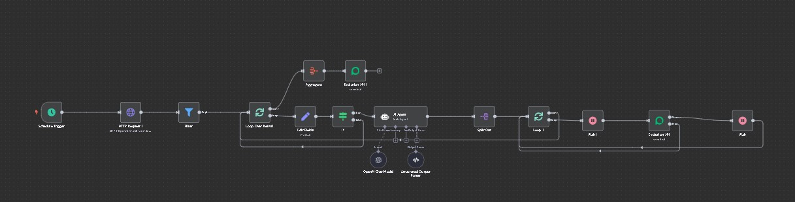

# 🚨 Follow-up Automático de Clientes Críticos

> **Categoria:** Customer Success | **Complexidade:** ⭐⭐ | **Status:** ✅ Em Produção

## 📝 Visão Geral

Criei este workflow para a equipe de projetos fazer acompanhamento proativo de clientes em situação crítica durante a implantação do sistema. Quando um cliente é classificado como "CRÍTICO" pela equipe (baseado no andamento dos treinamentos e uso da plataforma), este workflow detecta automaticamente e envia uma mensagem personalizada via WhatsApp para tentar recuperar e apoiar o cliente.

O diferencial é que usa IA (GPT-4o-mini) para criar mensagens únicas e contextualizadas para cada cliente, mantendo um tom profissional e oferecendo suporte específico.

## 🎯 Por Que Criei Esta Automação

**O problema:**
- Clientes em dificuldade na implantação podem desistir do sistema
- Equipe de projetos não consegue acompanhar manualmente todos
- Follow-up manual consome muito tempo
- Difícil manter consistência no acompanhamento
- Clientes críticos podem passar despercebidos

**A solução:**
Um sistema que:
- Roda semanalmente (toda segunda-feira 09:30)
- Busca clientes com status "CRÍTICO" na API
- Gera mensagem personalizada com IA para cada um
- Envia via WhatsApp automaticamente
- Notifica equipe de projetos quando concluído

## 🏗️ Como Funciona

### Fluxo do Processo

```
1. Schedule Trigger (Segunda-feira 09:30 - Semanal)
   ↓
2. Busca lista de clientes na API do sistema
   ↓
3. Filtra apenas clientes "HABILITADO"
   ↓
4. Loop por cada cliente:
   ├─ Verifica se Status = "CRÍTICO"
   ├─ Se não for crítico: pula
   └─ Se for crítico: processa
   ↓
5. Para cliente crítico:
   ├─ IA gera mensagem personalizada
   ├─ Quebra mensagem em partes (3 campos)
   ├─ Loop por cada parte da mensagem
   ├─ Envia parte 1 via WhatsApp
   ├─ Aguarda 15 segundos
   ├─ Envia parte 2 via WhatsApp
   ├─ Aguarda 15 segundos
   ├─ Envia parte 3 via WhatsApp
   └─ Volta para próximo cliente
   ↓
6. Ao finalizar todos:
   └─ Notifica Letícia (gestora) de sucesso
```

### Diagrama Visual

 

*Nota: Por questões de confidencialidade, o arquivo JSON não está disponível publicamente.*

## ⚙️ Componentes e Integrações

### Tecnologias Utilizadas:
- **N8N:** Plataforma de automação
- **API interna:** Sistema de gestão de clientes
- **OpenAI GPT-4o-mini:** Geração de mensagens contextualizadas
- **Evolution API:** Envio via WhatsApp
- **Schedule:** Execução semanal

### Nodes do Workflow:
- **Schedule Trigger:** Executa segunda 09:30
- **HTTP Request1:** Busca clientes da API
- **Filter:** Filtra apenas habilitados
- **Loop Over Items1:** Loop por clientes
- **Edit Fields:** Organiza dados
- **IF:** Verifica se é crítico
- **AI Agent:** Gera mensagem com IA
- **OpenAI Chat Model:** Modelo de linguagem
- **Structured Output Parser:** Formata saída
- **Split Out:** Quebra mensagem em partes
- **Loop 1:** Loop pelas partes da mensagem
- **Wait1:** Delay de 15 seg entre mensagens
- **Evolution API:** Envia WhatsApp
- **Wait:** Delay entre clientes
- **Aggregate:** Agrupa resultados finais
- **Evolution API1:** Notifica gestora

## 🔧 Funcionalidades Principais

### 1. Busca de Clientes na API Interna

Integração com sistema próprio de gestão:

**Endpoint:**
```
GET http://[SEU_SISTEMA]/api/IntegracaoClientes/GetClientes
?chave=[SUA_CHAVE_API]
```

**Retorna:**
```json
[
  {
    "Nome": "Loja Exemplo",
    "contato": "5511999998888",
    "Status": "CRÍTICO",
    "ResponsavelLoja": "João Silva",
    "Habilitado": "HABILITADO"
  },
  // ... mais clientes
]
```

**Campos importantes:**
- **Nome:** Nome da empresa cliente
- **contato:** WhatsApp no formato internacional
- **Status:** CRÍTICO, OK, EM ANDAMENTO, etc
- **ResponsavelLoja:** Nome do responsável/decisor
- **Habilitado:** Se cliente está ativo no sistema

### 2. Filtro Duplo de Clientes

Apenas clientes ativos E críticos são processados:

**Filtro 1 - Habilitados:**
```javascript
Filter Node:
IF (Habilitado === "HABILITADO") → Passa
ELSE → Ignora
```

**Filtro 2 - Críticos:**
```javascript
IF Node:
IF (Status === "CRÍTICO") → Processa com IA
ELSE → Pula para próximo
```

**Por que dois filtros?**
- Eficiência: não processa clientes inativos
- Foco: só gasta recursos com críticos
- Economia de créditos de IA e WhatsApp

### 3. Geração Inteligente de Mensagens com IA

O agente de IA cria mensagens únicas para cada cliente:

**Input para a IA:**
```javascript
{
  texto: `Nome do cliente: ${NomedoCliente}
          Para contexto a data de hoje é ${$now}`,
  
  systemMessage: `Você é um agente de IA que envia mensagens 
  aos clientes que estão com status CRITICO toda segunda-feira 
  de manhã, perguntando como está o andamento do processo de 
  implantação e se precisam de auxílio. Seja formal e profissional.`
}
```

**Structured Output Parser:**
```json
{
  "Boadia": "Boa tarde (cliente). Tudo bem? Esperamos que sim",
  "Motivodocontato": "Gostaríamos de acompanhar o progresso...",
  "Estamosadisposicao": "Permanecemos à disposição para..."
}
```

**Por que 3 campos separados?**
- Simula conversa humana
- Mensagens chegam em sequência
- Mais natural que texto grande único
- Aumenta engajamento

### 4. Envio Sequencial com Delays Humanizados

Mensagens são enviadas como "digitando":

**Sequência:**
```
1. Envia "Boadia"
   ↓
2. Wait 15 segundos (simula digitação)
   ↓
3. Envia "Motivodocontato"
   ↓
4. Wait 15 segundos
   ↓
5. Envia "Estamosadisposicao"
   ↓
6. Próximo cliente
```

**Código do delay:**
```javascript
Wait1 Node:
amount: 15 segundos
```

**Por que 15 segundos?**
- Tempo realista de digitação
- Não parece bot
- Cliente tem tempo de ler primeira mensagem
- Mais humano e natural

### 5. Loop Controlado com Reset

Processa cada cliente individualmente:

**Loop Over Items1:**
```javascript
// Loop principal de clientes
batchSize: 1  // Um cliente por vez
```

**Loop 1:**
```javascript
// Loop das 3 partes da mensagem
batchSize: 1  // Uma mensagem por vez
reset: {{ $('Loop 1').context.done }}  // Reseta ao terminar
```

**Fluxo:**
```
Cliente 1:
  Msg1 → Wait 15s → Msg2 → Wait 15s → Msg3
    ↓
Cliente 2:
  Msg1 → Wait 15s → Msg2 → Wait 15s → Msg3
    ↓
...
```

### 6. Notificação de Conclusão

Ao terminar, avisa a gestora de projetos:

**Evolution API1:**
```javascript
{
  instanceName: "Suporte",
  remoteJid: "[WHATSAPP_GESTOR]",
  messageText: `Bom dia!
O Follow-up com os clientes críticos foi realizado com sucesso!`
}
```

**Aggregate antes da notificação:**
- Coleta todos os outputs processados
- Garante que tudo foi concluído
- Envia notificação única no final

## 🎯 Exemplo de Mensagem Gerada

**Para cliente "João Silva" da "Loja Móveis Premium":**

```
[Mensagem 1 - 09:35]
Boa tarde, João! Tudo bem? Esperamos que sim.

[Aguarda 15 segundos]

[Mensagem 2 - 09:35]
Gostaríamos de acompanhar o progresso em relação ao processo 
de implantação até o momento e verificar se há alguma dúvida 
ou necessidade de suporte.

[Aguarda 15 segundos]

[Mensagem 3 - 09:35]
Permanecemos à disposição para quaisquer esclarecimentos 
que se fizerem necessários.
```

**Características:**
- Tom formal mas amigável
- Contextualizada (menciona nome)
- Oferece suporte específico
- Não parece automática
- Abre conversa para resposta

## 💡 Estratégia de Customer Success

### Por que Segunda-feira 09:30?
- Início da semana
- Momento produtivo
- Cliente mais receptivo
- Equipe disponível para follow-up manual
- Tempo para responder durante a semana

### Por que Semanal?
- Frequência adequada (não incomoda)
- Tempo para cliente agir
- Permite acompanhar evolução
- Evita spam

### Status "CRÍTICO" - O que significa?
Baseado em critérios da equipe de projetos:
- Não concluiu treinamentos
- Baixo uso do sistema
- Muitas dúvidas/tickets
- Risco de churn
- Não está progredindo na implantação

## 🛡️ Tratamento de Erros

### Evolution API com Continue on Error:
```javascript
onError: "continueErrorOutput"
```

**Se falhar envio:**
- Não trava workflow
- Continua para próximo cliente
- Registra erro no log
- Gestora ainda recebe notificação final

### Aggregate garante conclusão:
- Aguarda todos os clientes processarem
- Só notifica quando realmente terminou
- Não envia notificação parcial

## 🎓 Conceitos Técnicos Aplicados

### AI-Powered Personalization:
- Cada mensagem é única
- IA adapta tom ao contexto
- Não usa templates fixos
- Personalização em escala

### Multi-Stage Communication:
- Quebra mensagem em partes
- Delays entre partes
- Simula digitação humana
- Aumenta taxa de leitura

### Batch Processing with Reset:
- Loop externo (clientes)
- Loop interno (mensagens)
- Reset ao terminar cada cliente
- Processamento controlado

### Status-Based Automation:
- Filtros baseados em status
- Ação diferente por situação
- Automação condicional

## 💻 Configuração Necessária

### API Interna:

```javascript
{
  url: "http://[SEU_SISTEMA]/api/Integracao/GetClientes",
  chave: "SUA_CHAVE_API"
}
```

**Campos obrigatórios no retorno:**
- Nome
- contato (WhatsApp)
- Status
- ResponsavelLoja
- Habilitado

### OpenAI:

```javascript
{
  model: "gpt-4o-mini",
  credenciais: "SUA_API_KEY"
}
```

### Evolution API:

```javascript
{
  instanceName: "Suporte",
  credenciais: "SUAS_CREDENCIAIS"
}
```

**WhatsApp da Gestora:**
- Configurar número para notificação
- Node "Evolution API1"

## 🚀 Como Usar

### Setup Inicial:

1. **Configure API interna** com chave válida
2. **Configure OpenAI** com API key
3. **Configure Evolution API** (WhatsApp)
4. **Ajuste número da gestora** para notificações
5. **Customize system prompt** da IA se necessário
6. **Teste manualmente** antes de ativar

### Personalização do Prompt:

Para mudar tom ou conteúdo das mensagens:

```javascript
// Node "AI Agent" → options → systemMessage

systemMessage: `Você é um agente de IA que envia mensagens 
aos clientes que estão com status CRITICO toda segunda-feira 
de manhã...

[AJUSTE O TOM E CONTEÚDO AQUI]
`
```

### Ajuste de Frequência:

Para mudar o schedule:

```javascript
// Node "Schedule Trigger"

// Semanal nas segundas 09:30 (atual)
interval: daysInterval: 7

// Para diário:
interval: daysInterval: 1

// Para quinzenal:
interval: daysInterval: 14
```

## 📊 Métricas Sugeridas para Acompanhar

### Efetividade do Follow-up:
- Taxa de resposta dos clientes críticos
- Tempo médio até resposta
- % de clientes que saem de "CRÍTICO"
- Taxa de conversão para "OK"

### Operacional:
- Número de críticos por semana
- Média de mensagens enviadas
- Taxa de erro no envio
- Tempo de execução total

## ⚠️ Boas Práticas

### Follow-up Manual Necessário:
- Automação é o primeiro contato
- Equipe deve acompanhar respostas
- Cliente crítico precisa atenção humana
- Automação + pessoal = melhor resultado

### Monitoramento:
- Verifique logs semanalmente
- Confirme que gestora recebeu notificação
- Revise mensagens geradas pela IA
- Ajuste prompt se necessário

### Evitar Spam:
- Uma vez por semana é adequado
- Não aumentar frequência
- Se cliente responder, parar automação
- Respeitar preferências de contato

## 📚 Aprendizados

### O que funcionou bem:
- IA cria mensagens mais naturais que templates
- Quebra em 3 partes aumenta engajamento
- Delays humanizados melhoram recepção
- Notificação final mantém gestora informada
- Filtro duplo evita envios desnecessários

### Desafios:
- Calibrar tom da IA (formal mas não robótico)
- Definir timing dos delays
- Garantir que API interna está sempre online
- Balancear automação com toque humano

### Melhorias futuras:
- Adicionar campo "última data de follow-up" para não duplicar
- Escalonar tom baseado em quantas semanas está crítico
- Integrar respostas com sistema de tickets
- Dashboard de taxa de recuperação
- Alertas para críticos que não respondem

## 🤝 Integração com Processo de CS

### Antes do Workflow:
1. Equipe de projetos monitora clientes
2. Classifica status baseado em critérios
3. Atualiza status na API

### Durante o Workflow:
1. Automação detecta críticos
2. Envia mensagem de suporte
3. Cliente recebe acompanhamento

### Depois do Workflow:
1. Cliente responde (ou não)
2. Equipe de CS monitora respostas
3. Ações manuais conforme necessário
4. Atualiza status após resolução

---

## 📄 Notas Importantes

> 🎯 **Customer Success:** Este workflow é parte de uma estratégia maior de retenção.

> 🤖 **IA + Humano:** Automação faz primeiro contato, mas equipe é essencial no follow-up.

> ⚠️ **Prioridade:** Clientes críticos têm alta prioridade - garantir follow-up manual também.

> 📊 **Métricas:** Acompanhar taxa de recuperação para medir efetividade.

> 💬 **Tom:** Mensagens devem ser profissionais mas empáticas - cliente está com dificuldade.

---

**Criado em:** 2025  
**Última atualização:** 13/10/2025  
**Status:** ✅ Em produção  
**Frequência:** Semanal (Segunda 09:30)  
**Objetivo:** Reduzir churn e aumentar sucesso na implantação
