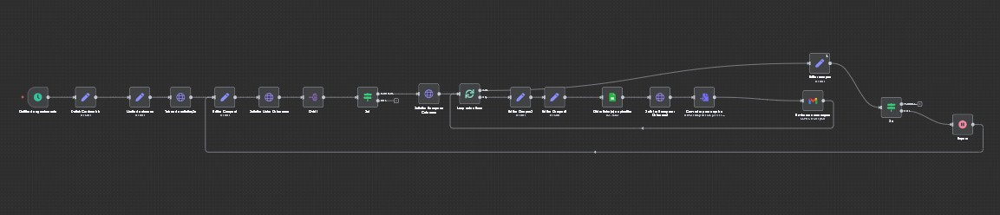

# ⚠️ Sistema de Cobrança Automática de Boletos Atrasados

> **Categoria:** Financeiro | **Complexidade:** ⭐⭐⭐⭐ | **Status:** ✅ Em Produção

## 📝 Visão Geral

Criei este workflow para fazer o acompanhamento ativo de boletos em atraso. Ele roda diariamente, identifica todos os boletos com status "ATRASADO", busca o PDF atualizado e envia automaticamente um email de lembrete personalizado para cada cliente com pendência.

O diferencial é que o email não é genérico - ele busca informações do responsável financeiro na planilha de clientes e envia uma mensagem profissional e empática, com o boleto atualizado em anexo.

## 🎯 Por Que Criei Esta Automação

**O problema:**
- Boletos vencem e ficam em aberto sem acompanhamento
- Enviar lembretes manualmente consome muito tempo
- Difícil identificar quais boletos estão atrasados
- Buscar e enviar 2ª via manualmente é trabalhoso
- Perda de receita por falta de follow-up

**A solução:**
Um sistema que:
- Identifica automaticamente boletos atrasados
- Busca informações do responsável financeiro
- Gera 2ª via do boleto atualizada
- Envia email profissional e personalizado
- Roda diariamente sem intervenção manual

## 🏗️ Como Funciona

### Fluxo do Processo

```
1. Schedule Trigger (08:10 AM diariamente)
   ↓
2. Define período de busca (90 dias atrás até 30 dias à frente)
   ↓
3. Autentica no Banco Inter
   ↓
4. Busca lista de cobranças (paginada)
   ↓
5. Para cada cobrança:
   ├─ Filtra apenas status "ATRASADO"
   ├─ Busca detalhes completos
   └─ Se atrasado, continua processamento
   ↓
6. Loop por cobrança atrasada:
   ├─ Formata dados (datas, valores)
   ├─ Busca responsável financeiro no Google Sheets
   ├─ Busca PDF atualizado do boleto
   ├─ Converte para arquivo anexável
   ├─ Envia email personalizado com PDF
   └─ Aguarda e processa próximo
   ↓
7. Verifica se há mais páginas
   ├─ Se sim: aguarda 1 minuto e busca próxima
   └─ Se não: finaliza
```

### Diagrama Visual



*Nota: Por questões de confidencialidade, o arquivo JSON não está disponível publicamente.*

## ⚙️ Componentes e Integrações

### Tecnologias Utilizadas:
- **N8N:** Plataforma de automação
- **Banco Inter API:** Listagem, detalhes e PDF de cobranças
- **Google Sheets:** Dados de clientes e responsáveis
- **Gmail:** Envio de emails com anexos
- **Schedule:** Execução diária automática

### Nodes do Workflow:
- **Schedule Trigger:** Dispara às 08:10
- **Set Credenciais:** Configurações
- **Range vencimento:** Define período
- **Request Token:** Autenticação OAuth2
- **Edit Fields1:** Controle de paginação
- **Request Listar Cobrancas:** Busca lista paginada
- **Split Out:** Separa cobranças
- **IF1:** Filtra apenas atrasados
- **Request Recuperar Cobranca:** Detalhes completos
- **Loop Over Items:** Processa um por vez
- **Edit Fields3:** Formata datas
- **Edit Fields2:** Organiza dados
- **Get row(s) in sheet:** Busca responsável financeiro
- **Request Recuperar Cobranca1:** Busca PDF
- **Convert to File:** Prepara anexo
- **Send a message:** Envia email
- **Edit Fields:** Controle de páginas
- **IF:** Verifica última página
- **Wait:** Delay entre páginas

## 🔧 Funcionalidades Principais

### 1. Filtro Inteligente de Atrasados

Diferente da sincronização que pega tudo, este workflow filtra apenas boletos com problema:

**Condição de filtro:**
```javascript
IF (situacao === "ATRASADO") {
  // Processa a cobrança
} ELSE {
  // Ignora
}
```

**Por que filtrar?**
- Não envia email para quem está em dia
- Foca apenas em pendências
- Economiza processamento e créditos de email

### 2. Busca de Responsável Financeiro

Antes de enviar email, busca quem é o responsável no Google Sheets:

**Query no Google Sheets:**
```javascript
documentId: "planilha_de_clientes"
sheetName: "Clientes"
filtro: nome === nome_da_cobranca
```

**Retorna:**
```json
{
  "Responsável financeiro": "Maria Silva",
  // outros dados do cliente
}
```

**Uso no email:**
```html
Bom dia, {{ $('Get row(s) in sheet').item.json['Responsável financeiro'] }}
```

**Por que buscar?**
- Personalização do email
- Direciona para pessoa certa
- Aumenta chance de resposta

### 3. Geração de 2ª Via Atualizada

Busca PDF do boleto diretamente da API:

**Endpoint:**
```
GET /cobranca/v3/cobrancas/{codigoSolicitacao}/pdf
```

**Headers:**
```javascript
Authorization: Bearer {token}
x-conta-corrente: {conta}
```

**Retorna:**
```json
{
  "pdf": "base64_string_do_pdf"
}
```

**Conversão para anexo:**
```javascript
// Convert to File node
operation: "toBinary"
sourceProperty: "pdf"
binaryPropertyName: "Boleto Atrasado - Sistema Lift"
mimeType: "application/pdf"
```

### 4. Email Profissional e Empático

Template HTML responsivo com tom educado mas firme:

**Estrutura do email:**

**Cabeçalho:**
- Logo/imagem da empresa
- Saudação personalizada com nome do responsável

**Corpo:**
- Mensagem empática valorizando o cliente
- Alerta visual sobre pendência (fundo amarelo)
- Dados do boleto (cliente, valor, vencimento)
- Informação sobre 2ª via anexada

**Seções especiais:**
```html
<div class="alert-section">
  ⚠️ Atenção: Boleto em Aberto
  
  Para te ajudar a regularizar a situação o mais rápido possível, 
  estamos enviando em anexo a 2ª via do boleto atualizado.
</div>

<div class="access-info">
  💡 Importante
  
  Se o pagamento já foi realizado, pedimos que desconsidere 
  essa mensagem e envie o comprovante.
</div>
```

**Fechamento:**
- Oferta de suporte
- Assinatura do financeiro
- Footer institucional

### 5. Processamento em Lote Controlado

Loop individual com controle de fluxo:

**Split In Batches:**
```javascript
batchSize: 1  // Um boleto por vez
```

**Fluxo:**
```
Boleto Atrasado 1 
  ↓
Busca responsável → Busca PDF → Envia email
  ↓
Volta pro loop
  ↓
Boleto Atrasado 2
  ↓
Busca responsável → Busca PDF → Envia email
  ↓
...
```

**Por que um por vez?**
- Evita sobrecarga da API
- Controle fino de erros
- Rate limiting respeitado

### 6. Paginação com Delays

Igual ao workflow de sincronização, mas com filtro adicional:

**Controle:**
```javascript
paginaAtual = 0

Loop:
  Busca página → Filtra atrasados → Processa
  paginaAtual++
  
  IF (ultimaPagina === false) {
    wait(60000)  // 1 minuto
    continua...
  }
```

**Delay de 1 minuto:**
- Respeita rate limits
- API não bloqueia
- Processamento estável

## 📊 Estrutura de Dados

### Google Sheets - Aba "Clientes"

Precisa ter estas colunas:

| Coluna | Descrição |
|--------|-----------|
| nome | Nome do cliente (matching) |
| Responsável financeiro | Nome para personalizar email |
| email | Email para envio |
| outros... | Outros dados do cliente |

### Dados da Cobrança Processados

```javascript
{
  Id: "codigo-solicitacao-uuid",
  Nome: "Empresa Cliente Ltda",
  Situação: "ATRASADO",
  Data Situação: "14/10/2025",
  Vencimento: "01/10/2025",
  Valor: 150.00,
  Email: "financeiro@cliente.com",
  Telefone: "11987654321",
  Conta: "236181483"
}
```

## 🎯 Exemplo de Execução Completa

**08:10 - Início:**
```
Schedule dispara
  ↓
Define período (90 dias atrás até 30 dias frente)
  ↓
Autentica no Banco Inter
```

**08:11 - Primeira página:**
```
Busca 100 cobranças
  ↓
Split Out → 100 itens individuais
  ↓
Para cada um:
  IF (situacao === "ATRASADO") → Processa
  ELSE → Ignora
  ↓
Encontrou 5 atrasados nesta página
```

**08:12 - Processamento dos atrasados:**
```
Atrasado 1:
  - Busca detalhes
  - Formata datas
  - Busca responsável financeiro
  - Busca PDF
  - Envia email
  ↓
Atrasado 2:
  - Busca detalhes
  ...
  ↓
(continua para os 5)
```

**08:13 - Próxima página:**
```
Wait 1 minuto
  ↓
Busca página 1
  ↓
Encontrou 3 atrasados
  ↓
Processa todos...
```

**Resultado final:**
- 8 boletos atrasados identificados
- 8 emails enviados com 2ª via
- Tempo total: ~5 minutos

## 💡 Detalhes do Template de Email

### Tom e Abordagem:

**Início empático:**
```
O Sistema Lift agradece sua confiança e valoriza muito 
o relacionamento com um cliente especial como você.
```

**Alerta claro mas educado:**
```
Para te ajudar a regularizar a situação o mais rápido 
possível, estamos enviando em anexo a 2ª via do boleto 
atualizado.
```

**Consequência mencionada:**
```
Solicitamos sua atenção para este assunto, pois a falta 
de pagamento pode resultar na suspensão do serviço.
```

**Abertura para diálogo:**
```
Se você tiver qualquer dúvida, por favor, entre em contato 
conosco o quanto antes para que possamos encontrar uma 
solução juntos.
```

### Responsividade:

- Desktop: Layout em 2 colunas
- Mobile: Adapta para coluna única
- Imagens responsivas
- Fontes legíveis

## 🛡️ Tratamento de Erros

### Cliente não encontrado no Sheets:
- Email não é enviado
- Continua para próximo boleto
- Não trava o workflow

### Falha ao buscar PDF:
- Retry automático (configurado na API request)
- Se falhar, pula este boleto
- Próxima execução tenta novamente

### Falha no envio de email:
- Registrado no log do N8N
- Não afeta próximos envios
- Pode monitorar falhas e retentar

## 🎓 Conceitos Técnicos Aplicados

### Conditional Processing:
- Filtro de status antes de processar
- Economiza recursos
- Foco apenas em pendências

### Data Enrichment:
- Dados do boleto (API)
- Dados do cliente (Sheets)
- União para email personalizado

### Binary Data Handling:
- PDF em Base64 da API
- Conversão para binário
- Anexo em email

### Template Engine:
- HTML com interpolação
- Dados dinâmicos
- Formatação condicional

## 💻 Configuração Necessária

### Credenciais:

Mesmas do sistema principal:
```javascript
{
  baseUrl: "https://cdpj.partners.bancointer.com.br",
  clientId: "SEU_CLIENT_ID",
  clientSecret: "SEU_CLIENT_SECRET",
  contaCorrente: "SUA_CONTA",
  planilha: "URL_PLANILHA"
}
```

### Gmail:
- OAuth2 configurado
- Permissões de envio
- Template HTML habilitado

### Google Sheets:
- Aba "Clientes" com estrutura correta
- Coluna "Responsável financeiro" preenchida
- OAuth2 configurado

## 🚀 Como Usar

### Setup:

1. **Configure credenciais** (mesmo do sistema principal)
2. **Garanta estrutura do Sheets** com coluna "Responsável financeiro"
3. **Personalize template** de email se necessário
4. **Teste manualmente** antes de ativar
5. **Ative schedule** para execução diária

### Monitoramento:

- Acompanhe logs no N8N
- Verifique emails enviados no Gmail
- Confirme recebimento com clientes
- Ajuste template conforme feedback

### Customização do Email:

Para mudar o tom ou conteúdo:
```javascript
// Node "Send a message"
// Edite o HTML no campo "message"
// Mantenha as variáveis: {{ }}
```

## ⚠️ Boas Práticas

### Frequência de Envio:
- Roda diariamente, mas cliente só recebe se continuar atrasado
- Não envia múltiplos emails no mesmo dia
- Considere adicionar filtro de "última data de envio"

### Tom do Email:
- Mantenha profissional e empático
- Evite tom agressivo
- Sempre ofereça suporte

### Follow-up Manual:
- Use este workflow como 1º contato
- Follow-up telefônico para valores altos
- Negocie com clientes recorrentes

## 📚 Aprendizados

### O que funcionou bem:
- Email personalizado tem taxa de resposta melhor
- 2ª via atualizada facilita pagamento
- Tom empático mantém relacionamento
- Automação garante que nenhum atraso fica sem follow-up

### Desafios:
- Sincronizar nomes entre cobrança e planilha
- Garantir que responsável financeiro está cadastrado
- Balancear firmeza com empatia no texto
- Evitar envios duplicados

### Melhorias futuras:
- Adicionar campo "data último envio" para evitar duplicatas
- Escalonar tom do email conforme dias de atraso
- Integrar com WhatsApp para 2º lembrete
- Dashboard de taxa de regularização pós-lembrete
- Notificação para financeiro quando não há resposta

## 🤝 Complementaridade com Outros Workflows

### Trabalha junto com:

**Sistema de Cobrança Principal:**
- Este envia boletos no vencimento
- Workflow de atrasados faz follow-up

**Sincronização de Cobranças:**
- Sincronização atualiza status
- Este workflow usa status atualizado

**Callbacks do Banco:**
- Banco atualiza status para "ATRASADO"
- Próxima execução detecta e envia lembrete

---

## 📄 Notas Importantes

> ⚠️ **Complementar:** Este workflow complementa o sistema de cobrança, não o substitui.

> 📧 **Personalização:** Quanto mais personalizado o email, melhor a taxa de resposta.

> 🤝 **Relacionamento:** Use como ferramenta de relacionamento, não apenas cobrança.

> 📊 **Métricas:** Acompanhe taxa de regularização após lembretes para otimizar.

---

**Criado em:** 2025  
**Última atualização:** 13/10/2025  
**Status:** ✅ Em produção  
**Frequência:** Diária (08:10 AM)  
**Foco:** Recuperação de inadimplência
